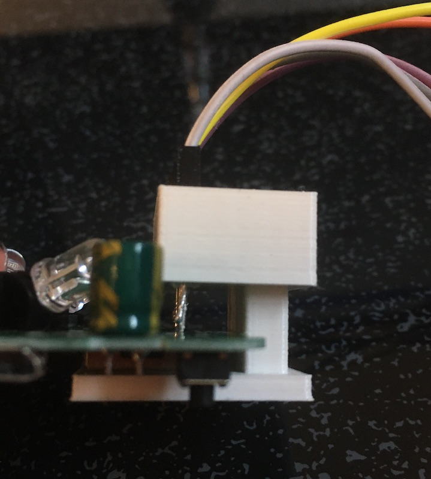
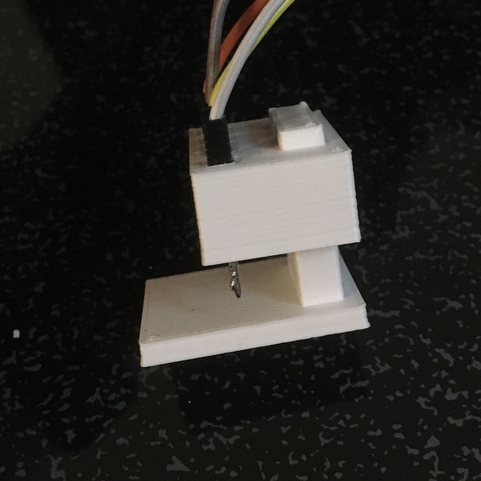

# S06-Pin-Holder
STL files for 3D printing Dupont cable pin holder for flashing (AVATTO, BAKEEY, AUVISIO and other compatible) S06 IR blaster Wifi bridges with alternative **[OpenMQTTGateway](https://github.com/1technophile/OpenMQTTGateway)** firmware, without having to solder.

Best to print with 0.25 nozzle. If you're using a larger nozzle size setting in your printing software the dividers probably won't be printed for the middle 3 Dupont cable pins, but it still works fine to hold them.

Insert the Dupont cables so that the pins are on equal height - this can still be adjusted later when moving the pin holder part down on the base.

Once you slide the S06 board in push down the pin holder part on the base, so that all pins have contact.

